# Sprintax-Lite

## Contents

1. [What is this?](#what-is-this)
2. [How it works](#how-it-works)
3. [Requirements](#requirements)
4. [Quick start](#quick-start)
5. [Demo credentials](#demo-credentials)
6. [Features](#features)
7. [Architecture](#architecture)
8. [Project structure](#project-structure)
9. [Domain model](#domain-model)
10. [Database schema](#database-schema)
11. [Development](#development)
12. [Application behavior](#application-behavior)
13. [Troubleshooting](#troubleshooting)
14. [Known limitations](#known-limitations)
15. [AI assistance](#ai-assistance)
16. [Repository](#repository)
17. [Screenshots](#screenshots)

## What is this?

Sprintax-Lite is a Symfony-based questionnaire application that guides clients through a multi-step tax questionnaire and generates a completed Form 1040-NR PDF from their answers.

After submission, PDF generation runs asynchronously through Symfony Messenger. The generated PDF is stored locally, attached to the submission, and emailed to the client's account email.

### Who uses it

| Role | What they do |
| --- | --- |
| **Admin** | Builds questionnaires and can access all submissions. |
| **Client** | Completes questionnaires and can access only their own submissions. |

These terms are used consistently below. New clients register at `/register` (`ROLE_CLIENT` only). Admins cannot self-register.

## How it works

```
Admin creates questionnaire
        ↓
Client fills in questionnaire
        ↓
Client reviews and submits
        ↓
Messenger queues PDF generation
        ↓
PDF is generated and stored
        ↓
Client can download the PDF
        ↓
PDF is also emailed locally via Mailpit
```

UI walkthrough: [Screenshots](#screenshots) at the end of this README.

## Requirements

Pick **one** way to run the app:

| Option | You need |
| --- | --- |
| **Docker** (recommended if installed) | [Docker Desktop](https://www.docker.com/products/docker-desktop/) running |
| **Local PHP** (XAMPP / system PHP) | PHP 8.4+ with `pdo_sqlite`, Composer 2 |

Stack: PHP 8.4+, Symfony 7.4, Doctrine ORM, SQLite, Twig, Forms, Security, Messenger, Mailer, FPDI/FPDF, PHPUnit, PHPStan.

## Quick start

### Option A - Docker

1. **Start Docker Desktop** and wait until it says it is running.
   If you see `open //./pipe/dockerDesktopLinuxEngine: The system cannot find the file specified`, Docker Desktop is not running (or not installed).

2. From the project root:

```bash
docker compose up --build
```

3. Open the app: [http://localhost:8080](http://localhost:8080)
   Mailpit inbox (PDF emails): [http://localhost:8025](http://localhost:8025)

Apache, the Messenger worker, and Mailpit start together. On first boot the app container runs migrations and loads demo fixtures. Log in with the [demo credentials](#demo-credentials) below.

To stop: `Ctrl+C`, or `docker compose down`. To wipe the database volume and start fresh: `docker compose down -v`, then `docker compose up --build` again.

### Option B - Local PHP (Windows / XAMPP)

Use **two terminals**. Run every command from the project root (`c:\xampp\htdocs\sprintax-lite` or your clone path).

#### First time only

```bash
composer install
```

Create `.env` from the example:

```bash
# macOS / Linux
cp .env.example .env

# Windows (PowerShell or cmd)
copy .env.example .env
```

Then create the schema and load demo data:

```bash
php bin/console doctrine:migrations:migrate --no-interaction
php bin/console doctrine:fixtures:load --no-interaction
```

`doctrine:fixtures:load` **purges** existing data and seeds demo users plus a two-step **1040-NR** questionnaire.

#### Every time you open the project

**Terminal 1 - web server**

```bash
php -S 127.0.0.1:8000 -t public
```

Open: [http://127.0.0.1:8000](http://127.0.0.1:8000)

**Terminal 2 - PDF worker** (required after a client finalizes a submission)

```bash
php bin/console messenger:consume async
```

Optional: run [Mailpit](https://github.com/axllent/mailpit) locally to view PDF emails at [http://localhost:8025](http://localhost:8025).

## Demo credentials

| Role | Email | Password | Entry |
| --- | --- | --- | --- |
| Admin | `admin@example.test` | `admin123` | `/admin` |
| Client | `client@example.test` | `client123` | `/client` |

If demo logins fail after a partial first boot, see [Troubleshooting](#troubleshooting).

## Features

- **Admin** (`/admin`): build questionnaires - ordered steps, questions (types, validation, visibility), choice options, and PDF mappings. List all client submissions at `/admin/submissions` and download a ready PDF.
- **Client** (`/client`): start or resume a submission. Each wizard step is its own route (POST/redirect/GET). Clients can go back but cannot skip ahead of `current_step`. Review is shown before submit. Finalize queues PDF generation; keep the worker running (Docker does this for you).

### Implemented extras

Assignment stretch goals that are already in this repository:

| Feature | Where |
| --- | --- |
| Structure history / audit trail | `/admin/questionnaires/{id}/history` and `/admin/questionnaires/{id}/history/{version}` - every create/update/delete of steps, questions, options, and mappings stores a versioned snapshot with the editing admin |
| Admin analytics | `/admin/analytics` - submission counts by status and per questionnaire, plus emailed PDFs and stored answers |
| Visual coordinate picker | Add/Edit PDF mapping - click the blank form (served from `resources/pdf/{formType}.pdf`) to fill page + X/Y mm; manual fields still work if the template file is missing |
| JSON API | `GET /api/questionnaires` and `GET /api/questionnaires/{id}` (`ROLE_ADMIN`); `GET /api/submissions/{id}` (owning client or admin; other clients get 404). Session auth (same form login), read-only |
| Email PDF delivery | After async PDF generation, the worker emails the file to the client account (Mailpit locally); see Messenger section |
| CI pipeline | GitHub Actions with parallel backend and frontend jobs (see CI section) |

## Architecture

Pragmatic Clean Architecture / hexagonal layout. HTTP never talks to Doctrine or PDF libraries directly.

```
Controller (Presentation)
 ↓
Application use case (writes, rules, orchestration)
 or repository port (simple reads)
 ↓
Domain
 ↑
Infrastructure implementations
```

| Layer | Namespace | Responsibility |
| --- | --- | --- |
| Domain | `App\Domain` | Entities, value objects, repository interfaces, calculation/PDF contracts. No Symfony, HTTP, Forms, or Twig. Doctrine mapping attributes and collections only. |
| Application | `App\Application` | Use cases for submission flow (start/save/finalize), calculation, PDF generate/download/email, registration, and audit recording. Admin structure writes are consolidated into `WriteQuestionnaire`, `WriteSteps`, `WriteQuestions`, `WriteOptions`, and `WriteMappings`. Simple list/get reads call repository ports from Presentation (no passthrough query wrappers). |
| Infrastructure | `App\Infrastructure` | Doctrine repositories, FPDI adapter, local filesystem, 1040-NR calculator, Messenger, Mailer. |
| Presentation | `App\Presentation` | Thin controllers and forms for admin, client, security, and a read-only JSON API. |

Ports: `CalculatorInterface`, `PdfGeneratorInterface`, `FileStorageInterface`, `QuestionnaireRepositoryInterface`, `SubmissionRepositoryInterface`, `UserRepositoryInterface`, `QuestionnaireRevisionRepositoryInterface`, `AnalyticsRepositoryInterface`, `ActorProvider`, `PasswordHasherInterface`, `SubmissionPdfMailer`, `PdfGenerationScheduler`.

There are no generic managers, base CRUD services, or abstract domain service classes. Business rules do not live in controllers or Twig.

## Project structure

```
src/
├── Domain/           # entities, value objects, ports
├── Application/      # use cases
├── Infrastructure/   # Doctrine, PDF, Messenger, Mailer, security adapters
└── Presentation/     # thin controllers and forms

resources/
└── pdf/              # blank Form 1040-NR template (1040-nr.pdf)

tests/
├── Domain/
├── Application/
├── Infrastructure/
├── Presentation/
├── Architecture/
└── Support/

var/
├── data.db           # local SQLite (dev)
└── pdf/              # generated submission PDFs
```

Composer suites group those tests as `test:unit`, `test:functional`, and `test:messenger` (see [Running tests](#running-tests)).

## Domain model

```
User
 └── QuestionnaireSubmission
 ├── Questionnaire
 │ └── QuestionnaireStep
 │ └── Question
 │ └── QuestionOption
 └── Answer
```

`QuestionMapping` belongs to the questionnaire and points at a question **or** a computed field (page + X/Y mm + optional font size).

`QuestionnaireRevision` is an append-only trail of structure changes (version, action, actor, summary, full structure snapshot). It references the questionnaire by id so history survives independent of cascade deletes.

Invariants:

- Steps and questions keep a 1-based position within their parent. `Questionnaire` is the aggregate root for structure.
- Question `key` values are unique inside a questionnaire.
- Choice questions (`single_choice`, `multi_choice`) may have options; other types may not.
- `yes_no` is a dedicated type, not an admin-configured choice list.
- PDF mappings cannot reference a question that is not on the questionnaire.
- A submission starts on the first step, belongs to one client and one questionnaire, and keeps at most one answer per question.
- Status only moves `in_progress` → `finalized` → `pdf_ready`. The generated file path is stored when the submission becomes `pdf_ready`.
- Clients are created with `User::registerClient()`; admins with `User::provisionAdmin()`.

## Database schema

SQLite tables used by the app (plus Symfony `messenger_messages` and `doctrine_migration_versions`). Local DB file: `var/data.db`.

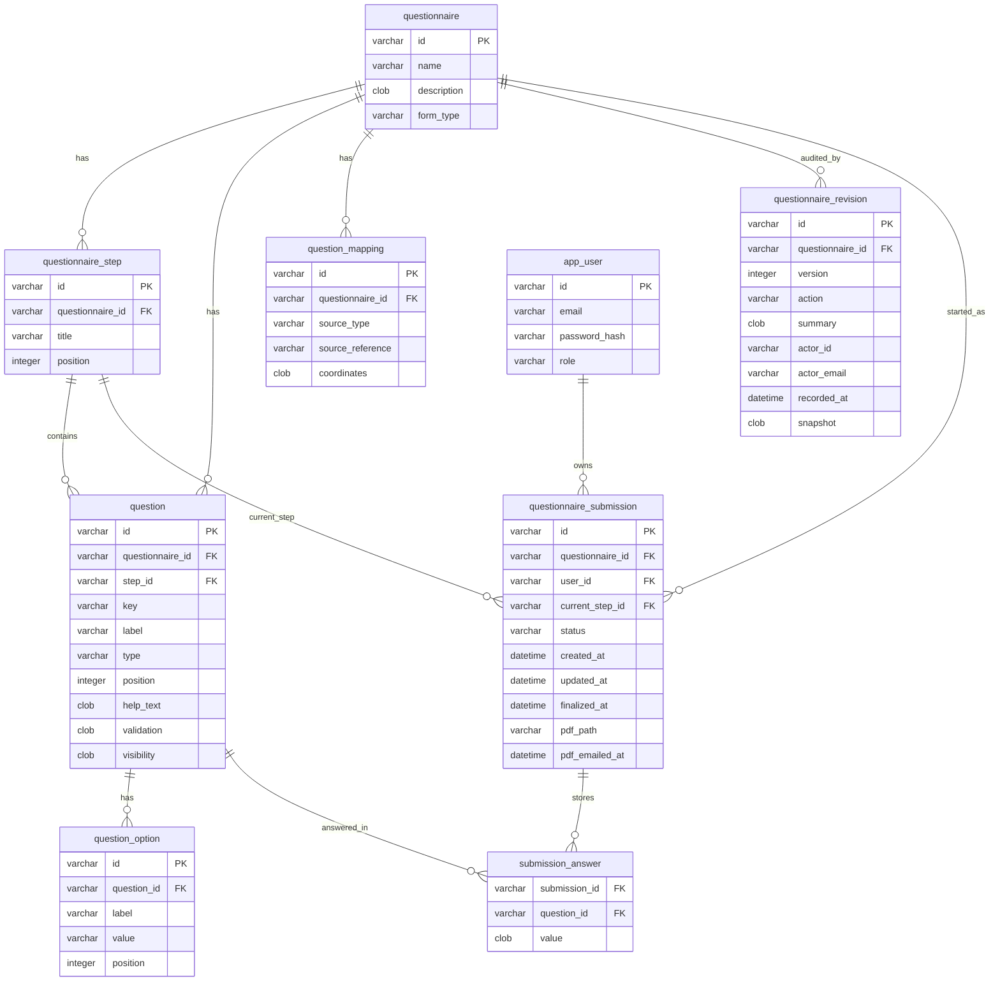

| Table | Role |
| --- | --- |
| `questionnaire` | Form definition (`form_type` selects calculator/PDF template) |
| `questionnaire_step` | Ordered wizard pages |
| `question` | Fields on a step (type, validation, visibility JSON) |
| `question_option` | Labels/values for choice questions |
| `question_mapping` | PDF overlay source (question key or computed field) + page/X/Y mm |
| `questionnaire_revision` | Append-only structure audit trail |
| `app_user` | Admin and client accounts |
| `questionnaire_submission` | Client run of a questionnaire (status + PDF path) |
| `submission_answer` | One stored answer per question per submission |

## Development

Local commands for schema, Docker helpers, async PDF, tests, static analysis, and CI.

### Environment variables

| Variable | Purpose |
| --- | --- |
| `APP_ENV` | `dev`, `test`, or `prod` |
| `APP_SECRET` | Symfony secret |
| `DATABASE_URL` | SQLite path |
| `MESSENGER_TRANSPORT_DSN` | Async Messenger transport (Doctrine queue by default) |
| `MAILER_DSN` | SMTP for PDF email. Local PHP defaults to Mailpit at `smtp://127.0.0.1:1025`. Docker Compose sets `smtp://mailer:1025`. |
| `MAILER_FROM` | From address on the PDF email (not the recipient) |

Docker Compose interpolates `APP_ENV`, `APP_DEBUG`, `APP_SECRET`, and `MAILER_FROM` from the host. `MAILER_DSN` is set in `docker-compose.yml` for the Mailpit service.

### Database migration

Local schema (default env):

```bash
php bin/console doctrine:migrations:migrate --no-interaction
```

Mapping and sync check, same as CI (`--env=test`):

```bash
php bin/console doctrine:migrations:migrate --no-interaction --env=test
php bin/console doctrine:schema:validate --env=test
php bin/console doctrine:migrations:up-to-date --env=test
```

In `dev`, Messenger uses the Doctrine transport and expects `messenger_messages`, which migrations do not create.

### Docker extras

Apache and the Messenger worker start together. SQLite lives in the `sqlite_data` volume. Linux `vendor/` packages live in `vendor_data` so Windows and container PHP builds do not mix.

This stack is for local use (`APP_ENV=dev`). `/_profiler` and `/_wdt` require `ROLE_ADMIN`. Do not publish port 8080 on a shared host without `APP_ENV=prod`, `APP_DEBUG=0`, and a unique `APP_SECRET`.

Commands that write SQLite or `var/cache` should run as `www-data`:

```bash
docker compose exec --user www-data app php bin/console doctrine:migrations:migrate --no-interaction
docker compose exec --user www-data app php bin/console doctrine:fixtures:load --no-interaction
docker compose exec app composer test
docker compose exec --user www-data app php bin/console cache:warmup --env=dev --no-interaction
docker compose exec app composer phpstan
docker compose logs -f worker
```

### Running the Messenger worker

Finalize does **not** build the PDF in the HTTP request. It marks the submission finalized and dispatches `GenerateSubmissionPdfMessage` on the `async` transport.

```bash
php bin/console messenger:consume async
```

Docker Compose already runs that in the `worker` service (`docker compose logs -f worker`).

Jobs retry up to three times, then move to `failed`. The handler is idempotent: a second delivery does not write another file or send another email if the PDF was already stored. After the file is written, the worker emails it to the **client account email**. Email send runs inside the PDF worker (`message_bus: false`) so `pdf_emailed_at` is recorded only after the transport accepts the message. If sending fails, the PDF stays `pdf_ready` for download and the job retries the email.

### Running tests

Development workflow: after each functionality, add or update tests for that behavior, run the matching suite, fix failures, then stop for review before the next phase. Prefer unit tests for domain rules, visibility, and calculation; functional (WebTestCase) tests for admin builder, client wizard, auth, and PDF download; messenger tests for async PDF handling.

```bash
composer test
composer test:unit
composer test:functional
composer test:messenger
composer lint
```

| Suite | Covers |
| --- | --- |
| unit | Visibility, calculation, domain rules, PDF orchestration, voters, architecture |
| functional | Register, login, admin builder, structure history, analytics, coordinate picker, JSON API, wizard, resume, conditionals, review, finalize, authorization, PDF download, waiting UX, PDF email |
| messenger | Handler behavior and idempotency |

`composer test` runs all three. PHPUnit uses SQLite at `var/test.db`.

Docker: `docker compose exec app composer test`.

### Running PHPStan

Level 8, `src/` and `tests/`, PHP 8.4, no baseline. Warm the container XML first:

```bash
php bin/console cache:warmup
composer phpstan
```

Docker: warm the **dev** cache as `www-data`, then run PHPStan as the default user so it can write `var/phpstan`:

```bash
docker compose exec --user www-data app php bin/console cache:warmup --env=dev --no-interaction
docker compose exec app composer phpstan
```

### CI

GitHub Actions (`.github/workflows/ci.yml`) runs on push to `main` and on pull requests. Jobs run in parallel (PHP 8.4 + SQLite; no MySQL/PostgreSQL). A final `CI status` job fails the workflow unless every job succeeds.

| Area | Jobs |
| --- | --- |
| Backend | lint & PHP syntax, unit tests, messenger tests, PHPStan, Doctrine schema & migrations |
| Frontend | Twig lint, static CSS/JS checks (`node --check`), Presentation functional tests |

Local equivalents:

```bash
composer lint
composer lint:backend
composer lint:frontend
composer test:unit
composer test:messenger
composer test:functional
composer phpstan
php bin/console doctrine:migrations:migrate --no-interaction --env=test
php bin/console doctrine:schema:validate --env=test
```

## Application behavior

How PDF overlay, visibility, security, and calculation work.

### PDF generation

Overlay goes through `PdfGeneratorInterface`. `GenerateSubmissionPdf` drives the flow; `FpdiPdfGenerator` stamps values. The generator has no hardcoded field positions.

#### Template

The blank form is `resources/pdf/{formType}.pdf` from the questionnaire's `FormType` (locked after a client starts). For Form 1040-NR that is `resources/pdf/1040-nr.pdf`, which is shipped in the repo so overlay and the coordinate picker work after clone. Other PDFs under `resources/pdf/` stay gitignored. Tests use their own dummy PDFs. Renaming the questionnaire display name does not change the template.

#### Field mapping

Admin `QuestionMapping` entries supply page + X/Y in mm for **visible** answers and computed fields. Amount mappings use the **left** edge of the IRS amount column. Checkbox marks (`X`) are centered on the mapped point.

Demo fixtures map names, wages/treaty, tax totals, and filing-status checkmarks only. Do **not** map `married`, `residency`, or `income_types` onto the form (that prints stray text like `no` or `resident`).

#### Computed fields

Yes/no answers are never stamped as the words "yes"/"no". Filing status uses computed fields `filing_single` / `filing_mfs` that emit `X`.

#### File storage

File checks and directory creation go through `FileStorageInterface`. The worker writes under `var/pdf/` and stores `{id}.pdf` on the submission when status becomes `pdf_ready`.

#### Download and waiting UX

Download is `GET /submissions/{id}/pdf` (`BinaryFileResponse`). `SubmissionVoter::DOWNLOAD` gates access; another client or an unauthenticated visitor gets **404** (not 403) so existence is not leaked. A PDF that is not ready also returns 404.

While status is `finalized`, the confirmation, review, client home, and submission pages refresh every 5 seconds, send `Cache-Control: no-store`, and show a preparing message with a **Check now** link. Refresh stops when the status becomes `pdf_ready` and the download link appears.

#### Email delivery

After the file is stored, the worker emails it to the client account. Mail stays local via Mailpit (see [Troubleshooting](#troubleshooting)).

### Conditional visibility

Rules live on the question (`equals` / `not_equals`). `QuestionVisibilityEvaluator` applies them **server-side** against answers keyed by question key - not JavaScript.

- Every condition on a question must hold (AND).
- Missing or blank text answers hide both `equals` and `not_equals` dependents.
- An empty multi-choice list is “none selected”; `equals` / `not_equals` mean contains / does not contain.
- A hidden or missing controller hides its dependents. Cyclic rules hide both sides.
- Extra POST fields for a hidden question are not stored. When a condition hides a question, its previous answer is dropped. Finalize does not require hidden questions.

### Authorization

`SecurityUser` adapts the domain `User` so the domain stays free of Symfony. Routes use `#[IsGranted('ROLE_ADMIN')]` / `ROLE_CLIENT`. `SubmissionVoter` allows a client to view/edit/download only their own submission; admins can access any submission. Denied submission and PDF HTML/API access typically returns **404** rather than 403 (same privacy pattern as the JSON API).

### Calculation architecture

`CalculateSubmission` picks a `CalculatorInterface` by the questionnaire's `FormType` (selected when the questionnaire is created, independent of the display name). `Form1040NrCalculator` is a simplified 10% tax stand-in. Wages print on the wages line; `total_income`, ECI, AGI, and `taxable_income` are all `max(0, wages - treaty)` so those lines foot. `tax_owed` is 10% of that net. The calculator may still return `0.0` for unused `amount_owed` / `amount_overpaid`; the PDF overlay blanks those zero balance lines instead of printing `0.00`. Output keys are for PDF mappings, not IRS rate tables. Form type cannot change after a client has started the questionnaire.

## Troubleshooting

| Problem | What to try |
| --- | --- |
| Docker engine error / pipe not found | Start Docker Desktop and wait until it is fully running, then retry `docker compose up --build`. |
| Demo logins fail | Reload fixtures. Local: `php bin/console doctrine:fixtures:load --no-interaction`. Docker: `docker compose exec --user www-data app php bin/console doctrine:fixtures:load --no-interaction`, or `docker compose down -v` and start again. |
| PDF never becomes ready | Keep the Messenger worker running. Local: `php bin/console messenger:consume async`. Docker: `docker compose logs -f worker`, or `docker compose run --rm --user www-data worker php bin/console messenger:consume async`. |
| Readonly SQLite / permission errors in Docker | Fix ownership: `docker compose exec app chown -R www-data:www-data /var/www/html/var/data` |
| Bad or stale PDF overlays | Reload fixtures, delete cached PDFs, and start a **new** client submission with the worker running. |
| No PDF email in inbox | Open Mailpit at [http://localhost:8025](http://localhost:8025). Docker uses `smtp://mailer:1025`; local PHP uses `MAILER_DSN` from `.env` (`smtp://127.0.0.1:1025`). Mailpit does not send to the public internet. |

Clear cached PDFs (Windows PowerShell):

```bash
php bin/console doctrine:fixtures:load --no-interaction
Remove-Item -Force var/pdf/*.pdf -ErrorAction SilentlyContinue
```

## Known limitations

- Tax figures are a stand-in, not IRS Publication 519 / 1040-NR worksheets.
- SQLite is the only supported database; the schema is not tuned for concurrent production traffic.
- The blank Form 1040-NR template is shipped at `resources/pdf/1040-nr.pdf` for local PDF overlay and the coordinate picker.
- Overlay is coordinate-based (admin mm placements or the click picker). There is no IRS AcroForm field fill.
- The JSON API is session-backed and read-only; unauthenticated calls follow the form-login redirect rather than a dedicated JSON `401`.
- Messenger `messenger_messages` is created by Doctrine transport auto-setup in `dev`, not by migrations.
- Demo passwords are fixtures for local/CI use, not a production identity store.
- Mail stays on local Mailpit only; it does not send to the public internet.

## AI assistance

Cursor/AI assistance was used for tests, and review of that written code. I directed each assignment phase, required tests after each functionality, and decided what to keep in the repository.

## Repository

https://github.com/Dzhemile-dzh/sprintax-lite

## Screenshots

### Login and register

Sign in (`/login`) and create a client account (`/register`). Admins cannot self-register.

| Login | Register |
| --- | --- |
| 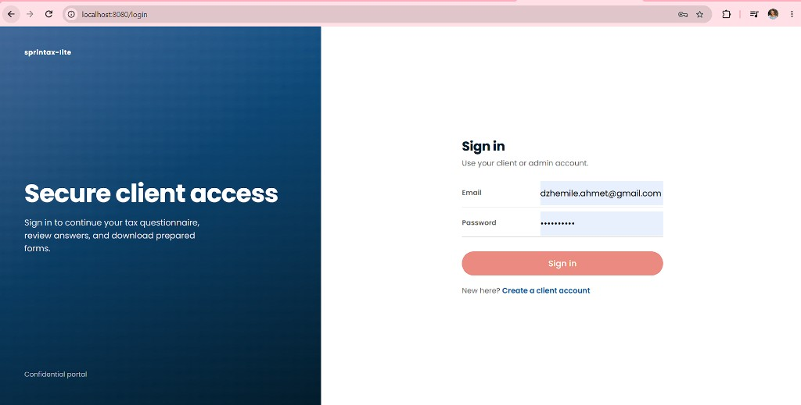 | 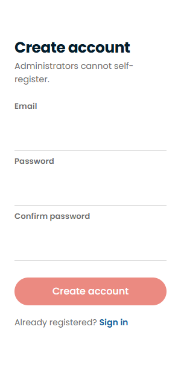 |

### Client pages

Client home, wizard steps, review, submit, and PDF-ready confirmation. Mailpit shows the emailed PDF locally.

#### Client home

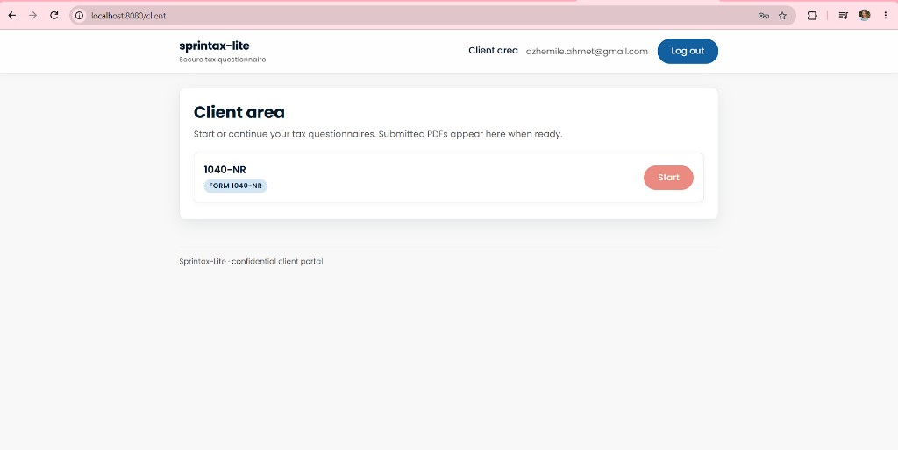

#### Wizard - Personal

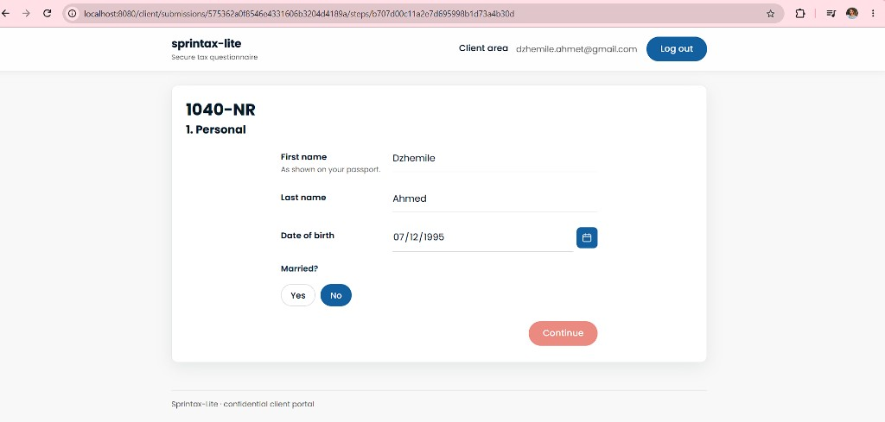

#### Wizard - Income

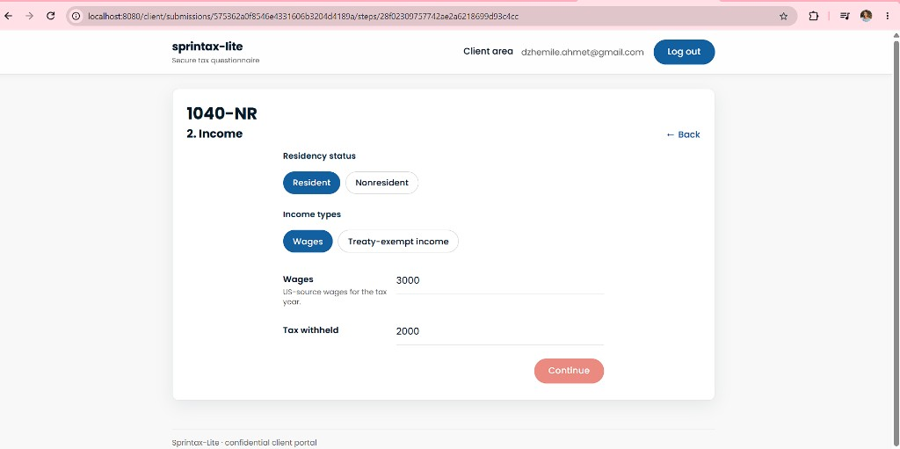

#### Review

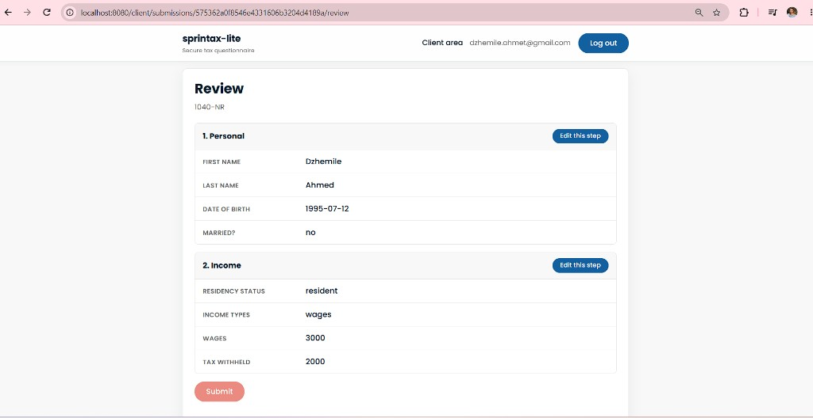

#### Submitted (PDF ready)

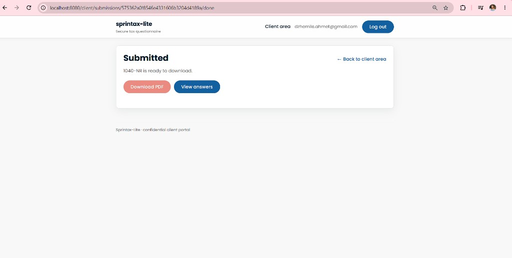

#### PDF email (Mailpit)

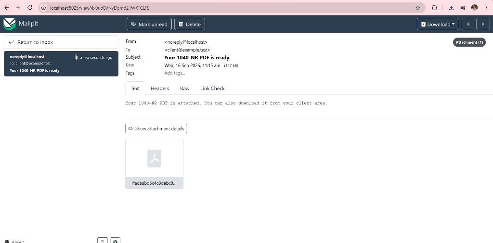

### Admin pages

Questionnaire list, builder, question forms, analytics, structure history, and the PDF coordinate picker.

#### Questionnaires

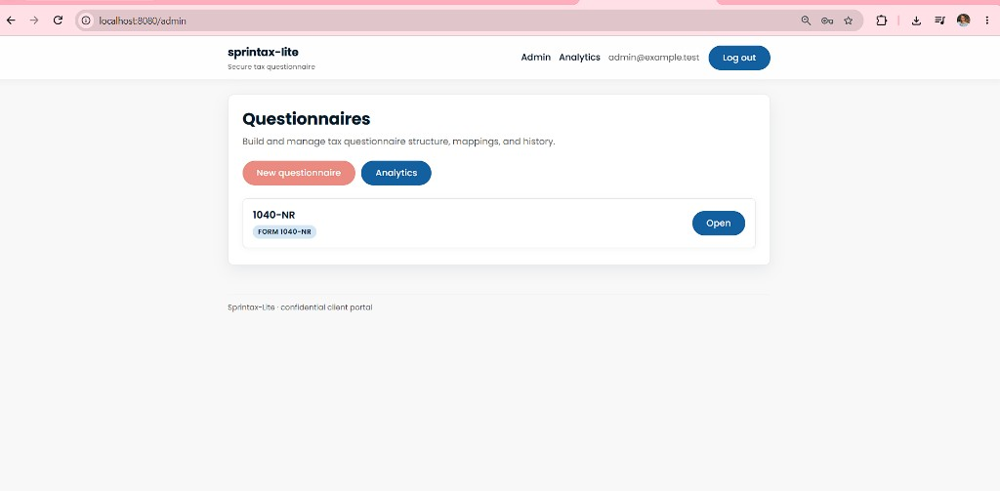

#### New questionnaire

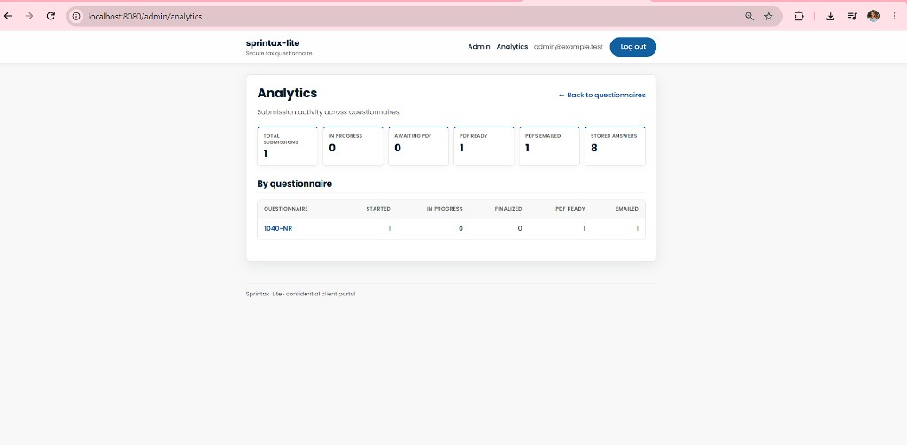

#### Builder - Personal step

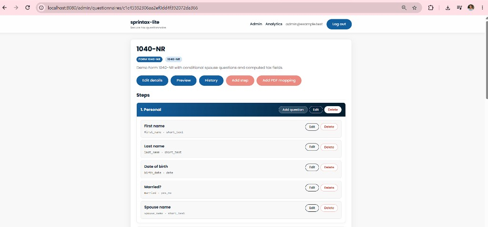

#### Builder - Income step

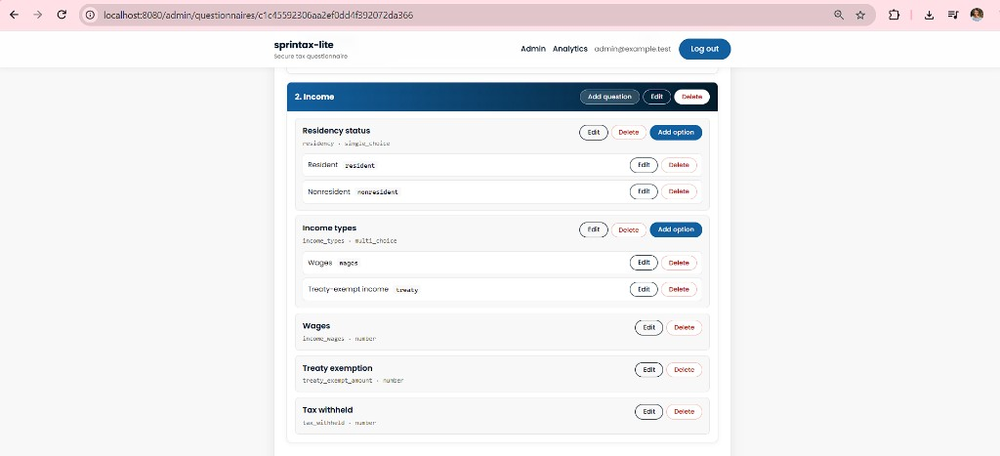

#### Add question

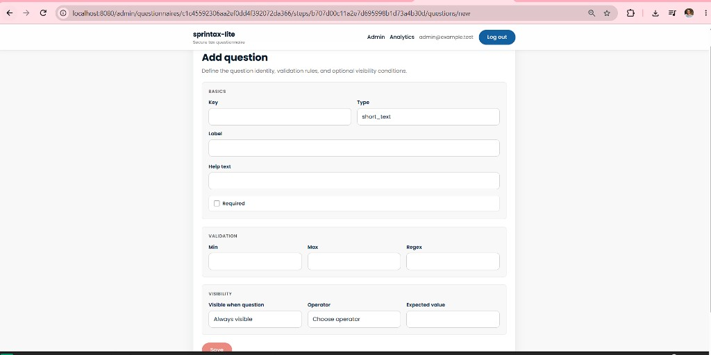

#### Edit question

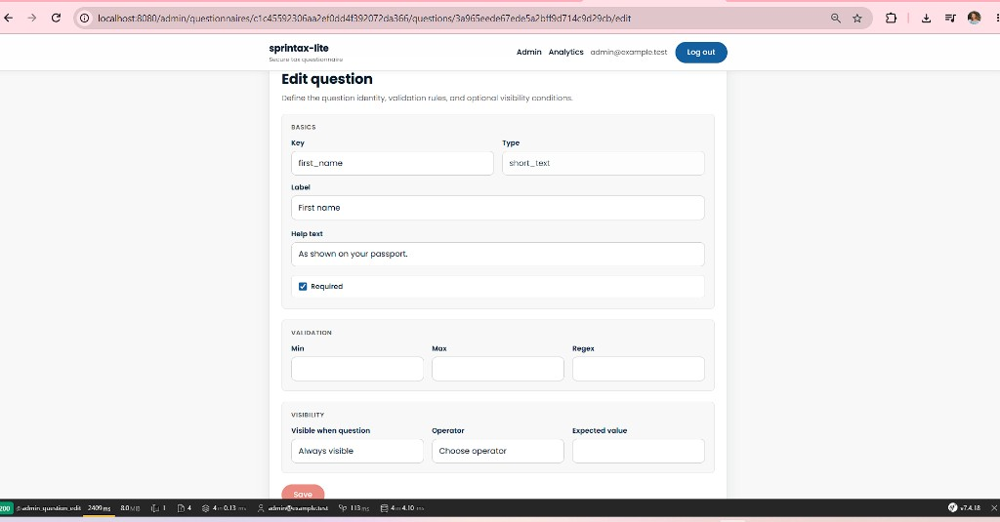

#### Analytics

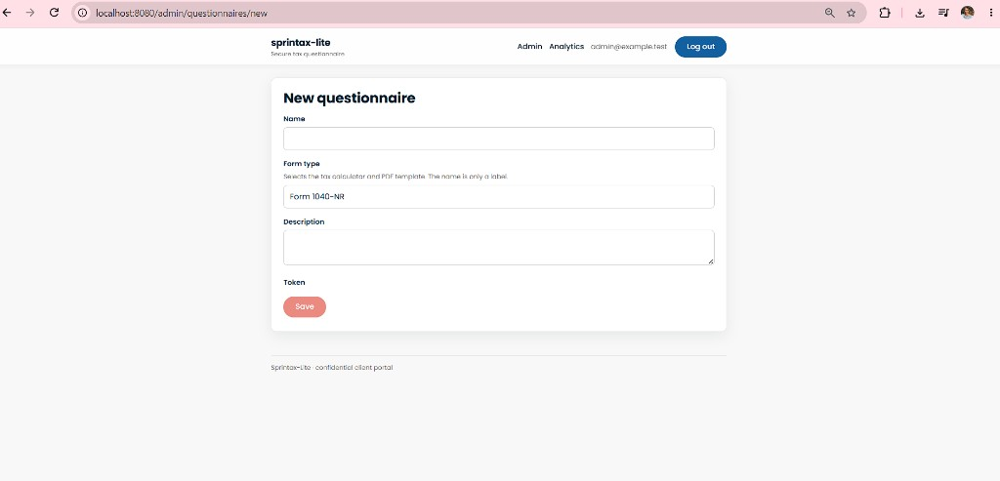

#### Change history

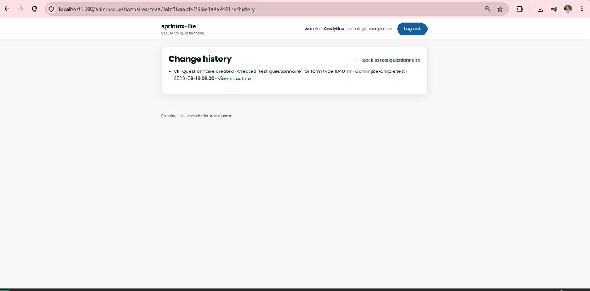

#### History version detail

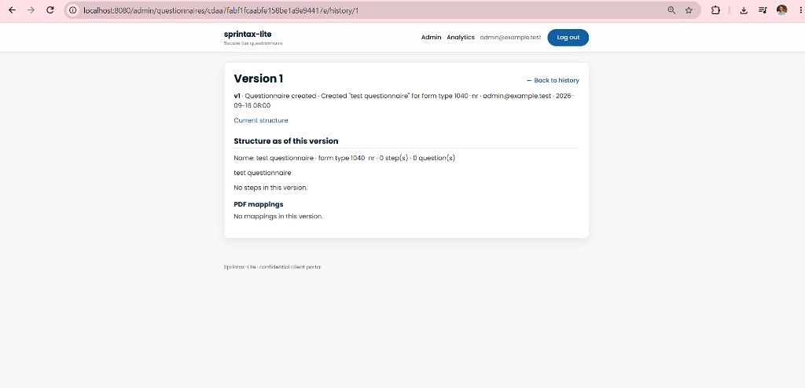

#### PDF coordinate picker

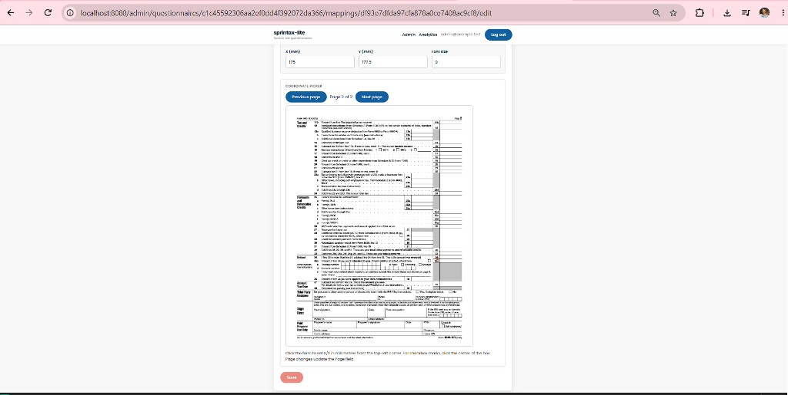

### Generated PDF

Example overlay onto Form 1040-NR after a client finalizes (names, Single filing status, wages, tax, and refund lines).

#### Page 1

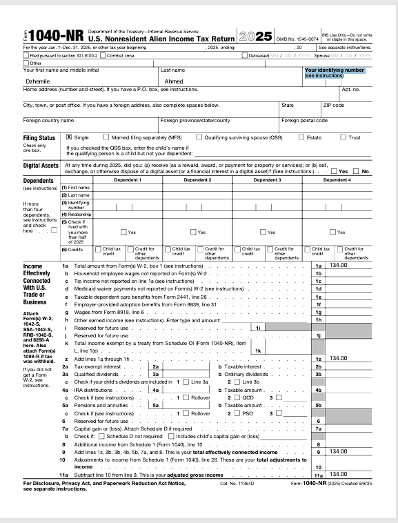

#### Page 2

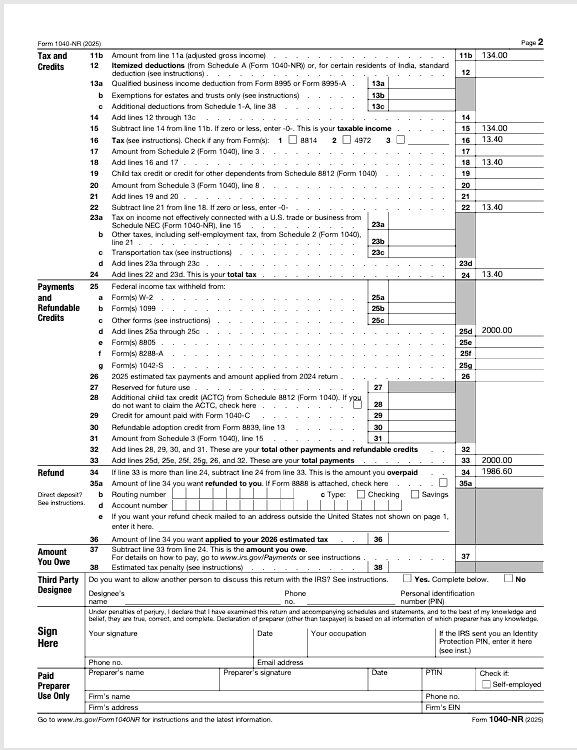

---

Authored by Dzhemile Ahmed
